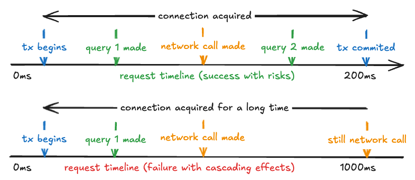

# Type-Safe Queries in Go

In this post, we will discuss how to write type-safe queries in Go. We will use the `sqlc` tool to generate Go code from
SQL queries. This will allow us to write type-safe queries in Go.
The main advantage of using `sqlc` is that there cannot be any runtime errors due to type mismatches in the queries as
the parameters and returned row types are determined during the compile time.
We'll also discuss how to use `sqlc` alongside `pgx` to implement different scenarios like transactions, connection
pools, CTEs and more.

## What is `sqlc`?

`sqlc` is a tool that generates Go code from SQL queries.
It takes SQL files as input alongside migration files and generates Go code that can be used to execute the queries.
Let's continue with an example to understand how `sqlc` works.

### Code Generation

Migration file: `migrations/000001_init.up.sql`

```sql
create table uesrs
(
    id   serial primary key,
    name text not null,
    age  int  not null
);
```

Queries file: `queries.sql`

```sql
-- name: CreateUser :one
insert into users (name, age)
values ($1, $2)
returning id, name, age;
```

Running `sqlc` will generate the following Go code:

Models: `users/models.go`

```go
type User struct {
    ID   int32
    Name string
    Age  int32
}
```

Queries: `users/queries.sql.go`

```go
type CreateUserParams struct {
    Name string
    Age  int32
}

func (q *Queries) CreateUser(ctx context.Context, arg CreateUserParams) (User, error) {
    ...
}
```

Querier: `users/querier.go`

```go
type Querier interface {
    CreateUser(ctx context.Context, arg CreateUserParams) (User, error)
}
```

The generated interface witch can be used to mock the database queries in tests
is available via setting `emit_interface` option in the `sqlc` configuration. 
You can see that structured parameters and returned types are generated based on the SQL queries and migrations.

## Use cases

Before we dive into the specific usages, let's see a basic user creation with pgxpool:

```go
func main() {
    ctx := context.Background()

    pool, err := pgxpool.New(ctx, os.Getenv("DATABASE_URL"))
    if err != nil {
        panic(err)
    }

    q := users.New(pool)

    user, err := q.CreateUser(ctx, users.CreateUserParams{
        Name: "Amir",
        Age:  12,
    })

    if err != nil {
        panic(err)
    }

    fmt.Printf("%+v\n", user)
}
```

- ✅ Type-safe queries

### Dependency injection

Now we change the implementation to a more common scenario in web servers:

```go
type Server struct {
    pool *pgxpool.Pool
}

func NewServer(
    pool *pgxpool.Pool,
) Server {
    return Server{
        pool: pool,
    }
}

func (s Server) CreateUser(ctx context.Context, name string, age int32) ([]byte, error) {
    tx, _ := s.pool.Begin(ctx)
    q := users.New(tx)

    user, err := q.CreateUser(ctx, users.CreateUserParams{
        Name: name,
        Age:  age,
    })

    if err != nil {
        return []byte{}, err
    }

    err = tx.Commit(ctx)
    if err != nil {
        return nil, err
    }

    return []byte(fmt.Sprintf("%+v\n", user)), nil
}
```

This is not a desirable implementation as we only inject the pool and not the Querier.
The Querier should be injected to the server to make it more testable.
Imagine we want to test the `CreateUser` function, we need to mock the Querier. However in the current implementation,
we need to mock specific SQL queries.

- ✅ Type-safe queries
- ✅ Transactions
- ❌ Mocking utilities

### Injecting `Querier` as a dependency

Having `emit_methods_with_db_argument` [option](https://docs.sqlc.dev/en/stable/reference/config.html#go) set in the configuration, 
the generated methods also accept a `DBTX` interface which is a `pgxpool.Pool` instance in this case.

```go
type Querier interface {
    CreateUser(ctx context.Context, db DBTX, arg CreateUserParams) (User, error)
}
```

Now we need to inject both the `Querier` and the `pgxpool.Pool` to the server when instantiating it.

```go
func NewServer(
    querier users.Querier,
    pool *pgxpool.Pool,
) Server {
    return Server{
        querier: querier,
        pool:    pool,
    }
}
```

- ✅ Type-safe queries
- ✅ Transactions
- ✅ Mocking utilities

It's worth mentioning that generating mocks is possible with [the mockery](https://github.com/vektra/mockery).

## Notes on Scaling and Error Handling

- It's always good to have a transaction deferred rollback in case of an error. 
Even if all the error scenarios are covered at the moment, future changes might introduce security vulnerabilities.
```go
tx, err := pool.Begin(ctx)
if err != nil {
    return nil, err
}
defer func() {
    err = tx.Rollback(ctx)
    if err != nil {
        log.WithError(err).Error("failed to rollback transaction")
    }
}()
```

- When a transaction is started, it should be committed or rolled back as soon as possible.
Doing heavy or time taking operations such as making an HTTP request inside a transaction 
blocks the assigned connection until commited.



A slowdown in the HTTP request can cause a bottleneck in the connection pool and prevents other
important queries from being executed.

- It's also a good practice to have a timeout for the queries or entire transaction.
```go
queryCtx, cancel := context.WithTimeout(ctx, 50*time.Millisecond)
defer cancel()

user, err := q.CreateUser(queryCtx, pool, users.CreateUserParams{
    Name: name,
    Age:  age,
})
```

- Failure scenarios should be handled properly.
A degraded response is better than a 5xx error.

## Common Scenarios and Suitable Workarounds

### Interface Segregation / Package Separation

### Repetitive Models

### DTOs and Transforms

### CTEs

### Enums
